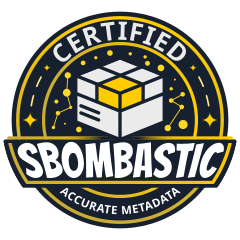

<div align="center">



[](https://plus.a-sit.at/open-source.html)
[](http://www.apache.org/licenses/LICENSE-2.0)
[](https://plugins.gradle.org/plugin/at.asitplus.gradle.sbombastic)


</div>

# SBOMbastic Gradle Plugin

Gradle plugin to generate accurate CycloneDX SBOMs for Kotlin Multiplatform and Kotlin/JVM projects (plugin id: `at.asitplus.gradle.sbombastic`).

Features:
- publication-aware CycloneDX SBOM generation
  - correct mapping of target-specific dependencies
  - recursive resolution of npm dependencies pulled in by Kotlin JS dependencies
- normalized PURLs and dependency alignment
- root KMP SBOM exposure through documentation variants in Gradle metadata
- supplier injection for first-party modules and third-party dependencies via prefix mapping JSON

## Configuration

Add `at.asitplus.gradle.sbombastic` to your root plugin. It must be a multi-module Gradle project.
Modules can be Kotlin Multiplatform or plain Kotlin/JVM projects.

Supported `gradle.properties` / environment keys:
- `sbombastic.enabled` global toggle, must be set to `true` to enable SBOMbastic
- `sbombastic.license.id` licence ID for the project (applies to all modules)
- `sbombastic.license.name` licence name for the project (applies to all modules)
- `sbombastic.license.url` licence URL for the project (applies to all modules)
- `sbombastic.supplier.name` full legal supplier name of the project, such as A-SIT Plus GmbH, JetBrains s.r.o; not a brand name or division name (applies to all modules)
- `sbombastic.supplier.urls` comma-separated URLs to the supplier (e.g.: `https://plus.a-sit.at, https://github.com/a-sit-plus`)
- `sbombastic.supplier.contactName` how to refer to the supplier when contacting them via e-mail. E.g.: `A-SIT Plus Opensource`
- `sbombastic.supplier.email` contact e-mail to reach out to the supplier
- `sbombastic.supplier.mappingsUrl` source supplier metadata for external dependencies (see below). Can be any supported URL scheme, but plain HTTP is not allowed

## External Supplier Metadata

Adding your metadata to your project is one thing. Enriching it with supplier metadata for external dependencies is 
something else entirely. Enter: `sbombastic.supplier.mappingsUrl`!
It allows you to define a source for external dependency suppliers, modelled after the CycloneDX JSON schema for supplier
metadata. Supplier information will be added to the resulting SBOMs for every matching group.
It is possible to use wildcard matching to model a group prefix (and only the prefix):
* `at.sitplus` will only match this exact group
* `at.asitplus.*` will match `at.asitplus.signum`, `at.asitplus.wallet`, etc. but it will not match `at.asitplusplus`

Expected JSON shape for `sbombastic.supplier.mappingsUrl`:

```json
[
  {
    "type": "mvn",
    "groups": ["at.asitplus.*"],
    "supplier": {
      "name": "A-SIT Plus GmbH",
      "urls": ["https://plus.a-sit.at", "https://github.com/a-sit-plus"],
      "contactName": "A-SIT Plus Opensource",
      "email": "opensource@a-sit.at"
    }
  },
  {
    "type": "npm",
    "packages": ["some-example-name", "@xampl/some-scoped-example"],
    "supplier": {
      "name": "Example, Inc.",
      "urls": ["https://example.com"],
      "contactName": "Example Open Source Inquiries",
      "email": "opensource@example.com"
    }
  }
]
```

## Manually Adding Dependencies

Sometimes a project may depend on external sources (e.g. when no published artefact of an external dependency exists).  
Such dependencies can be declared on a per-module basis using the custom `sbombastic` DSL:

```kotlin
sbombastic {
    manualDependency("upstream-lib") {
        version.set("1.2.3")
        vcsUrls.set(listOf("https://github.com/org/upstream-lib.git"))

        supplierName.set("Upstream Org")
        supplierUrls.set(listOf("https://github.com/org"))
        supplierContactName.set("Upstream Team")
        supplierEmail.set("oss@example.org")
    }
}
```


<hr>

<p align="center">
The Apache License does not apply to the logos, (including the A-SIT logo) and the project/module name(s), as these are the sole property of
A-SIT/A-SIT Plus GmbH and may not be used in derivative works without explicit permission!
</p>
